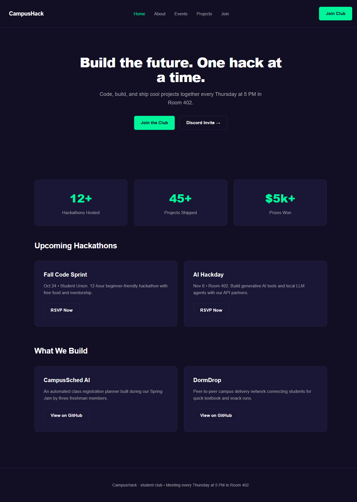
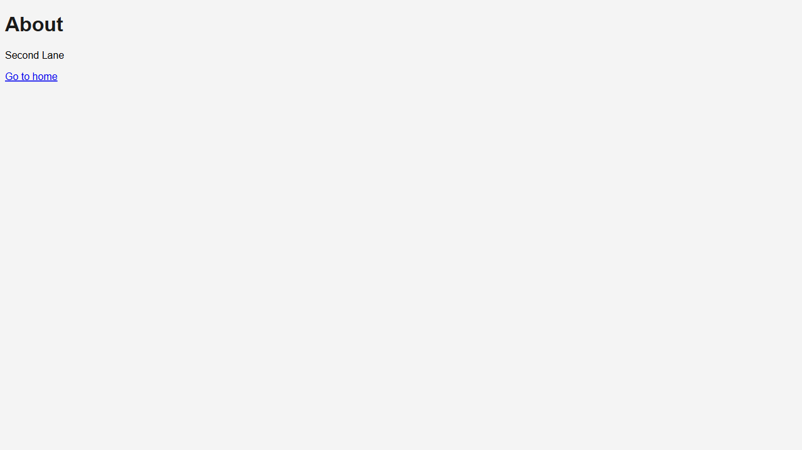
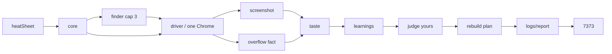

# Fresp

[](https://www.npmjs.com/package/fresp-ai-tester)
[](https://github.com/atireksd11/fresp-ai-tester)

**Local CLI: real Chrome, layout facts from the DOM, then an AI taste pass and a rebuild plan. HTML report on disk. No cloud login.**

You run a command. Fresp writes files. Open the report in the browser.

This **git repo** is day 2 (taste, plan, apply, multi-page report). The npm tarball **`fresp-ai-tester@0.1.4`** is still the day-1 overflow demo. Clone this if you want what the docs describe.

---

<table>
  <tr>
    <td align="center" width="50%">
      
      <br />
      <strong>Your pages</strong><br />
      <sub>Playwright PNGs. Fail/pass for overflow comes from the DOM, not from looking at pixels.</sub>
    </td>
    <td align="center" width="50%">
      
      <br />
      <strong>Examples</strong><br />
      <sub>Finder (or pinned URLs) → steal sheet → then judge yours.</sub>
    </td>
  </tr>
</table>

Overflow fact: Chrome is asked whether `document.documentElement.scrollWidth` is greater than `clientWidth`. Clip / overlap / contrast are **not** measured yet.

---

## Run from this repo

Node 20+.

```bash
git clone https://github.com/atireksd11/fresp-ai-tester.git
cd fresp-ai-tester
npm install
npx playwright install chromium
```

Put `FRESP_API_KEY` in `.env` if you want taste + plan (OpenRouter by default). No key is fine: facts and screenshots still run.

```bash
npm run log
```

Leave that terminal open. Open:

**http://127.0.0.1:7373/logs/report/index.html**

| Command | What it does |
| --- | --- |
| `npm run log` | Full audit (Chrome + optional AI) then serve report + demo |
| `npm run report` | Rebuild `logs/report/` from last JSON (no Chrome) and serve |
| `npm run apply` | Backup `fixtures/demo`, write the last plan onto it, open demo |

Apply is **demo only**. It does not push into some other project.

Ctrl+C the old 7373 process before starting another `log` / `report`.

---

## npm 0.1.4 (older)

Package name is **`fresp-ai-tester`**, not `fresp`.

```bash
npx playwright install chromium
npx fresp-ai-tester@0.1.4
```

That build is overflow + two pages + a single HTML file. Use the clone for day 2.

---

## What a day-2 run does



Core never talks to Chrome itself. Facts still work if the model is down.

| Piece | What you get |
| --- | --- |
| Driver | One Chromium, demo `file://` or https examples |
| Facts | Overflow only |
| Taste | Issues + steal notes (`docs/taste.md`) |
| Plan | Full CSS + full HTML per route |
| Apply | Writes `fixtures/demo` with a timestamped backup |
| Report | Overview, Plan, Pages, Playbook, Examples, Compare |
| Demo | `/` `/about` `/events` `/join` |

**Not yet:** clip / overlap / contrast facts, VS Code extension, apply-to-your-real-repo.

Taste is a vision model + a markdown bible. Not a vector database.

---

## Docs

| Doc | What it is |
| --- | --- |
| [VISION.md](docs/VISION.md) | Product |
| [ARCHITECTURE.md](docs/ARCHITECTURE.md) | Rooms and the run loop |
| [ENGINEERING.md](docs/ENGINEERING.md) | How the pieces are wired |
| [taste.md](docs/taste.md) | Judgement bible |
| [REPORT.md](docs/REPORT.md) | Report IA |
| [PLAN-AGENT.md](docs/PLAN-AGENT.md) | Rebuild plan shape |
| [FINDER.md](docs/FINDER.md) | Example search |
| [DAY-01](docs/journal/DAY-01.md) / [DAY-02](docs/journal/DAY-02.md) | What shipped each day |

---

## Links

- npm: [fresp-ai-tester](https://www.npmjs.com/package/fresp-ai-tester)
- Source: [atireksd11/fresp-ai-tester](https://github.com/atireksd11/fresp-ai-tester)

Playwright. Built in the open for Hack Club Stardance.
