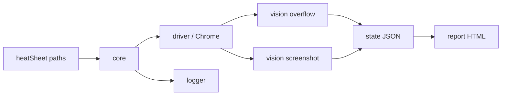

# Fresp

[](https://www.npmjs.com/package/fresp-ai-tester)
[](https://github.com/atireksd11/fresp-ai-tester)

**A local CLI that opens real Chrome, measures layout bugs on the live page, and drops an HTML report on disk.**

No cloud. No login. You run a command; Fresp writes files.

---

<table>
  <tr>
    <td align="center" width="50%">
      
      <br />
      <strong>Home — FAIL</strong><br />
      <sub>4000px bar → horizontal overflow</sub>
    </td>
    <td align="center" width="50%">
      
      <br />
      <strong>About — PASS</strong><br />
      <sub>Normal width → ok</sub>
    </td>
  </tr>
</table>

Those PNGs are what Playwright captured. The fail/pass is **not** from looking at the pixels. Chrome is asked: is `document.documentElement.scrollWidth` greater than `clientWidth`?

---

## Try it (2 commands)

Package name is **`fresp-ai-tester`**, not `fresp`. `npx fresp` will 404.

```bash
npx playwright install chromium
npx fresp-ai-tester@0.1.4
```

Node 20+. First run downloads Chromium. You should see Chrome open **home** (~3s), then **about**, and a log like:

```text
overflow: true
overflow
overflow: false
ok
```

JSON written by a local clone looks like this:

```json
[
  { "url": "http://localhost:3000/", "passed": false, "notes": "overflow", "shot": "home.png" },
  { "url": "http://localhost:3000/about", "passed": true, "notes": "ok", "shot": "about.png" }
]
```

From `npx` (another folder), those files land in the npm cache. From this repo they land in `logs/`.

---

## Run from source

```bash
git clone https://github.com/atireksd11/fresp-ai-tester.git
cd fresp-ai-tester
npm install
npx playwright install chromium
npm run log
```

Then open:

- `logs/report.html` — human report  
- `logs/last-run.json` — machine result  
- `logs/run.txt` — timestamps  
- `fixtures/baselines/*.png` — shots  

In this repo you can also run `npx fresp`.

---

## What v0.1 actually does

| Piece | What you get |
| --- | --- |
| Driver | Playwright Chromium, `file://` demo pages |
| Vision | Full-page screenshot + overflow fact |
| State | One scorecard per URL |
| Logger | Terminal + `logs/run.txt` (creates `logs/` if needed) |
| Report | `logs/report.html` |
| Demo | Broken home, clean about |

**Not in v0.1:** AI taste, clipped text / overlap / contrast, VS Code extension.

---

## How it is split



Core never talks to Chrome itself. Vision never writes the report. That split is on purpose so facts can stay working when a later AI key is missing.

Taste (later) is `docs/taste.md` plus a vision model — not a vector database.

---

## Docs

| Doc | What it is |
| --- | --- |
| [VISION.md](docs/VISION.md) | Product: facts first, then AI taste |
| [ENGINEERING.md](docs/ENGINEERING.md) | How the AI path, caches, and CLI should work |
| [taste.md](docs/taste.md) | Judgement bible (school vs portfolio vs slop) |
| [ARCHITECTURE.md](docs/ARCHITECTURE.md) | Rooms and folders |
| [DAY-01.md](docs/journal/DAY-01.md) | What shipped on day one |

---

## Links

- npm: [fresp-ai-tester](https://www.npmjs.com/package/fresp-ai-tester)  
- Source: [atireksd11/fresp-ai-tester](https://github.com/atireksd11/fresp-ai-tester)

Playwright. Built in the open for Hack Club Stardance.
