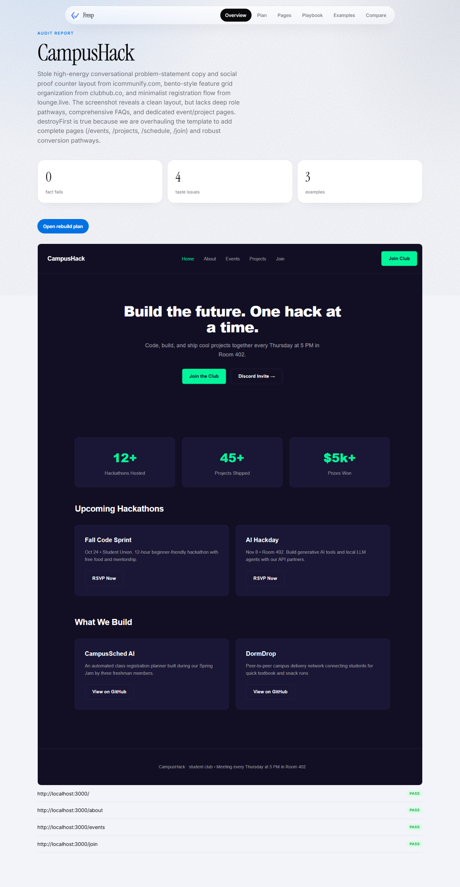
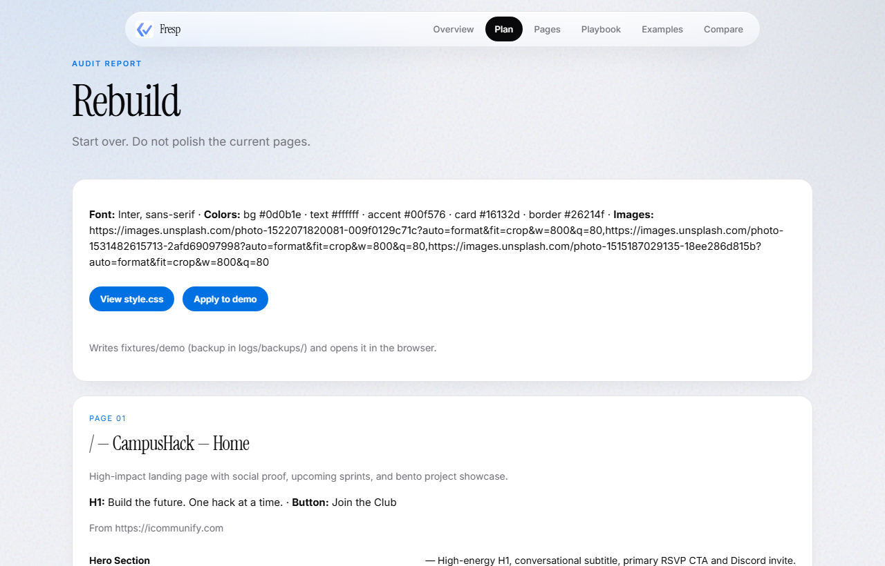
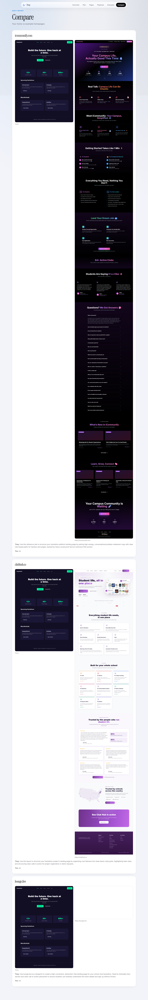
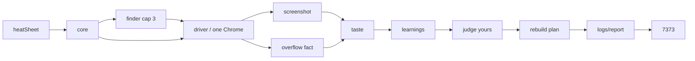

# Fresp

[](https://www.npmjs.com/package/fresp-ai-tester)
[](https://github.com/atireksd11/fresp-ai-tester)

**Local CLI: real Chrome, layout facts from the DOM, then an AI taste pass and a rebuild plan. HTML report on disk. No cloud login.**

You run a command. Fresp writes files. Open the report in the browser.

**npx `fresp-ai-tester@0.2.0`** is this day-2 CLI (taste, plan, apply, multi-page report).

---

<table>
  <tr>
    <td align="center" width="50%">
      
      <br />
      <strong>Overview</strong><br />
      <sub>Briefing after a run — facts, taste count, jump to the plan.</sub>
    </td>
    <td align="center" width="50%">
      
      <br />
      <strong>Plan</strong><br />
      <sub>Full CSS + HTML per route. Apply writes the demo (with a backup).</sub>
    </td>
  </tr>
  <tr>
    <td align="center" colspan="2">
      
      <br />
      <strong>Compare</strong><br />
      <sub>Your home vs example homepages the finder stole from.</sub>
    </td>
  </tr>
</table>

Chrome shots of **your** pages still land in `fixtures/baselines/`. Fail/pass for overflow comes from the DOM, not from looking at those pixels.

Overflow fact: Chrome is asked whether `document.documentElement.scrollWidth` is greater than `clientWidth`. Clip / overlap / contrast are **not** measured yet.

---

## Try it (`npx`)

Package name is **`fresp-ai-tester`**, not `fresp`. `npx fresp` will 404.

```bash
npx playwright install chromium
npx fresp-ai-tester@0.2.0
```

Optional, same terminal, if you want taste + plan:

```bash
# Windows PowerShell
$env:FRESP_API_KEY="sk-or-..."

# mac / linux
export FRESP_API_KEY=sk-or-...
```

Chrome opens the demo club pages, then (if the key is set) examples + taste + plan. Leave the process running and open **http://127.0.0.1:7373/logs/report/index.html**.

---

## Run from this repo

Node 20+.

```bash
git clone https://github.com/atireksd11/fresp-ai-tester.git
cd fresp-ai-tester
npm install
npx playwright install chromium
```

Put `FRESP_API_KEY` in `.env` if you want taste + plan (OpenRouter by default). No key is fine: facts and screenshots still run.

```bash
npm run log
```

Leave that terminal open. Open:

**http://127.0.0.1:7373/logs/report/index.html**

| Command | What it does |
| --- | --- |
| `npm run log` | Full audit (Chrome + optional AI) then serve report + demo |
| `npm run report` | Rebuild `logs/report/` from last JSON (no Chrome) and serve |
| `npm run apply` | Backup `fixtures/demo`, write the last plan onto it, open demo |

Apply is **demo only**. It does not push into some other project.

Ctrl+C the old 7373 process before starting another `log` / `report`.

---

## What a day-2 run does



Core never talks to Chrome itself. Facts still work if the model is down.

| Piece | What you get |
| --- | --- |
| Driver | One Chromium, demo `file://` or https examples |
| Facts | Overflow only |
| Taste | Issues + steal notes (`docs/taste.md`) |
| Plan | Full CSS + full HTML per route |
| Apply | Writes `fixtures/demo` with a timestamped backup |
| Report | Overview, Plan, Pages, Playbook, Examples, Compare |
| Demo | `/` `/about` `/events` `/join` |

**Not yet:** clip / overlap / contrast facts, VS Code extension, apply-to-your-real-repo.

Taste is a vision model + a markdown bible. Not a vector database.

---

## Docs

| Doc | What it is |
| --- | --- |
| [VISION.md](docs/VISION.md) | Product |
| [ARCHITECTURE.md](docs/ARCHITECTURE.md) | Rooms and the run loop |
| [ENGINEERING.md](docs/ENGINEERING.md) | How the pieces are wired |
| [SETUP.md](docs/SETUP.md) | Install, API key, fresp.json, npx vs clone |
| [taste.md](docs/taste.md) | Judgement bible |
| [BRIEF.md](docs/BRIEF.md) | What it actually does right now |
| [REPORT.md](docs/REPORT.md) | Report IA |
| [PLAN-AGENT.md](docs/PLAN-AGENT.md) | Rebuild plan shape |
| [FINDER.md](docs/FINDER.md) | Example search |
| [DAY-01](docs/journal/DAY-01.md) / [DAY-02](docs/journal/DAY-02.md) | What shipped each day |

---

## Links

- npm: [fresp-ai-tester](https://www.npmjs.com/package/fresp-ai-tester)
- Source: [atireksd11/fresp-ai-tester](https://github.com/atireksd11/fresp-ai-tester)

Playwright. Built in the open for Hack Club Stardance.
